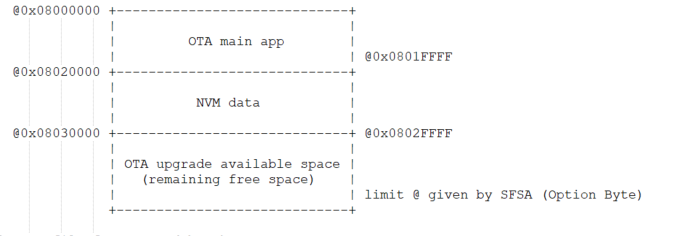
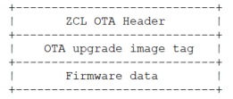
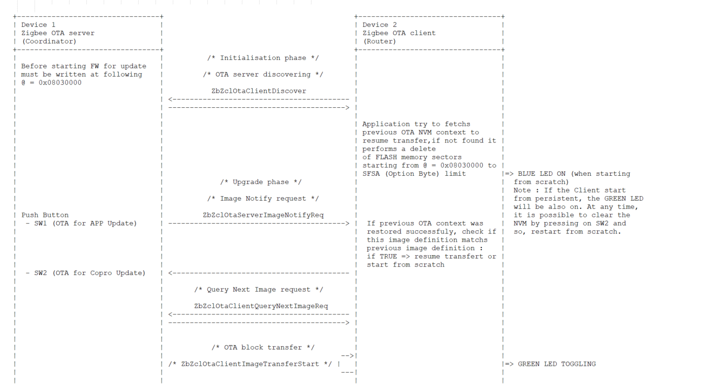
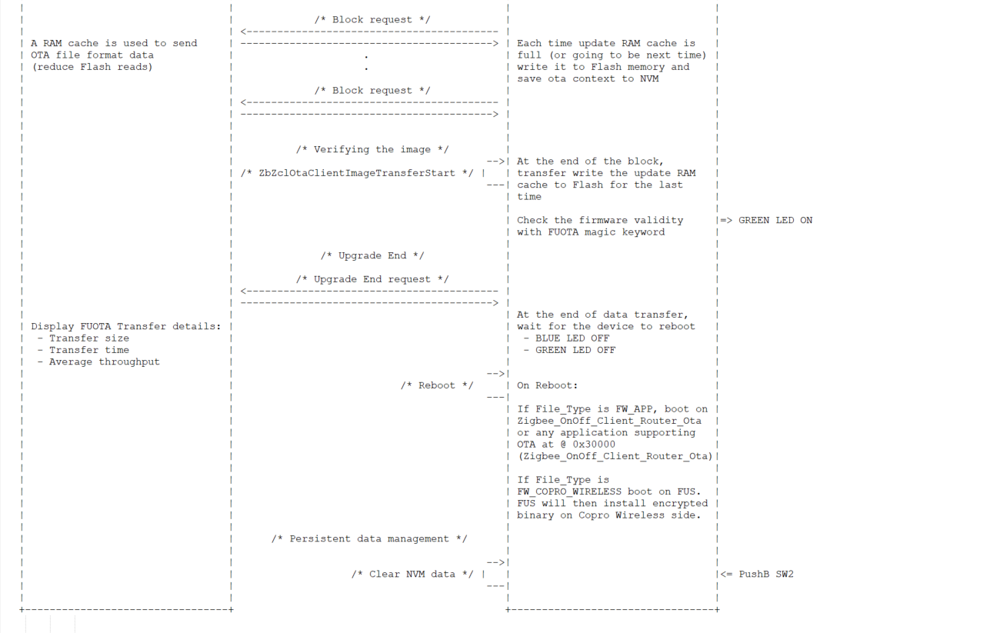

# STM32WB Zigbee OTA Client Router improved application

## Application Description 
This application demonstrates how to use the OTA cluster on multiple devices acting as a Client with Router role receiving and updating on a parallel way, the same OTA image from the ZC.

To run this demo: copy and paste this folder under `STM32CubeWB-master\Projects\P-NUCLEO-WB55.Nucleo\Applications\Zigbee\`. This demo was tested under SDK V1.16.

This router application will search and join the Zigbee network operated by the OTA server application, once on the network the user can trigger start the OTA process from the server using push button SW1 (M4 application firmware) and SW2 (M0 wireless coprocessor firmware).
The Zigbee OTA server (coordinator in this scenario) will inform all connected OTA clients that a new OTA image is available for download and can be served in parallel to all nodes.

In order for the client to persist its stack parameters data, Zigbee persistence data mechanism is used on the Zigbee_OTA_Client_Router application. This allows the client to reconnect to the coordinator network after the upgrade procedure.

For this application it is requested to have:

- 1 STM32WB55xx (Nucleo) board loaded with: 
    - wireless coprocessor : stm32wb5x_Zigbee_FFD_fw.bin
    - application : Zigbee_OTA_Server_Coord
    
- n (at least 1, at maximum 20) STM32WB55xx board loaded with: 
    - wireless coprocessor : stm32wb5x_Zigbee_FFD_fw.bin
    - application : Zigbee_OTA_Client_Router
    
    
#### IMPORTANT PREREQUISITES:
On Zigbee_OTA_Server_Coord a binary image has to be loaded at @0x08030000 before starting the process.
It can be FW application example (compatible with Ota settings, see Zigbee_OnOff_Client_Router_Ota for details)
or encrypted Copro Wireless binary (for example stm32wb5x_Zigbee_RFD_fw.bin).

# Demo use case :

This demo shows how to use OTA cluster for a firmware upgrade.

## 1. Flash splitting on Zigbee_OTA_Client_Router application

The STM32WB55xx internal Flash division on the OTA client side is set as follow:

## 2. OTA file format used by the server

The OTA upgrade process relies on OTA file format compatible files.
As a result, the OTA file format used for STM32WB55xx upgrade is as follow:

## 3. Generation of the OTA file from raw firmware
While the OTA file format described above is used in the data exchange between 
the OTA client and server, the OTA server stores the raw binary in Flash.
The OTA file format exchanged during the upgrade process is dynamically generated
at running time during the data transfer (ZCL OTA block request/response sequence).

## 4. Update procedure diagram

## To setup the application:

a) Open the project, build it and load your generated application on your STM32WB devices.

## To run the application:

a) On the coordinator, load the image you want to transfer to the router. This image can be loaded via Cube Programmer. This image must be stored at address 0x08030000. It can be either:
- An Application image (For example: binary generated using the Zigbee_OnOff_Client_Router_Ota project)
or
- An Encrypted Coprocessor Wireless binary (For example: stm32wb5x_Zigbee_RFD_fw.bin)

Note: To ensure a correct match between the Coprocessor Wireless and the Application, both binaries must be based on the same firmware package release. It is not possible to use an Application based on a firmware package version N with a Coprocessor Wireless binary based on firmware package version N+1 or N-1.

b) Start the ZR boards. This board is configured as Zigbee router and will be attached to the network created by the coordinator. Do the same for the other boards if applicable.

At this stage, the ZR boards try to connect to the ZC and fail. No Blue Led on ZR.

c.1) Start the ZC board. It must be the coordinator of the Zigbee network so in this demo application it is
the device running Zigbee_OTA_Server_Coord application (Device 1 in the above diagram).

c.2) ZR boards status:

At this stage, the ZR boards try to start from persistence this leads to two choices:
- Persistence Data read from NVM are valid -> the router takes back his role in the network.
GREEN LED is ON indicating a restart form persistence.

- No persistent data found or wrong data. A fresh start is performed, and the Zigbee network is automatically created
and BLUE LED is ON on all devices.

Note: On the Zigbee OTA client router, it is possible to clean the NVM via the SW2 push button and in this case no persistent
data will be found. A fresh start will be performed on next start up hence the method is to stop the ZC, to press SW2 (on all ZR with Green Leds),
and to restart the ZR by pressing the rst button.

  d)  Start the data transfer from the Coordinator to the Router by pressing on the appropriate push button.
        Press on SW1 for the OTA for Application update
        Press on SW2 for the OTA Coprocessor Wireless update

  e)  The download can take several seconds. The transfer rate can be followed looking to the traces.
 
  f)  During the transfer, the client can request to pause/resume the image download by using SW1 (to pause) or SW3 (to resume) buttons.
 
  g)  The application is also able to resume the transfer after a reset/power off (ideal for SED or energy harvester devices willling to resume download when V battery is good again) 

  h)  When the transfer is completed, reboot the router and check that the new binary has been correctly downloaded.
      If you have for instance downloaded the stm32wb5x_Zigbee_RFD_fw.bin, you should see in the traces the fact that it
      is now an RFD which is running and no more an FFD.
      If you have downloaded the new application (Zigbee_OnOff_Client_Router_Ota), you should see in the traces the message :
      "New M4 OTA firmware successfully running" being displayed.

   i) To play again with this use case and load a new image,  perform a full cleanup of the Flash of the OTA Client device using 
      Cube Programmer and reload the Zigbee_OTA_Client_Router associated with the stm32wb5x_Zigbee_FFD_fw binary.
#### Notes:
1. When LED1, LED2 and LED3 are toggling it is indicating an error has occurred on the application.
2. By default: `#define OTA_PREVENT_DOWNGRADE` is set to `TRUE`, for security reason firmware downgrade should be prevented but the user can change this if needed.
3. By default: `#define OTA_ABORT_RETRY_ENABLE` is set to `TRUE`, to retry resume download for `OTA_CLIENT_ABORT_MAX_RETRIES` times if an abort is received from the server.
4. By default: `#define USE_TAG_WRITE_CB` is set to `FALSE`, Set this to `TRUE` to handle multiple tags in a single OTA image.

# Hardware and Software environment

- This example runs on STM32WB55xx devices.

- This example has been tested with an STMicroelectronics STM32WB55RG_Nucleo board and can be easily tailored to any other supported device and development board.

- On STM32WB55RG_Nucleo, the jumpers must be configured as described in this section. Starting from the top left position up to the bottom right position, the jumpers on the Board must be set as follows:

  | Jumper | Description | State |
  |--------|-------------|-------|
  | CN11   | GND         | OFF   |
  | JP4    | VDDRF       | ON    |
  | JP6    | VC0         | ON    |
  | JP2    | +3V3        | ON    |
  | JP1    | USB_STL     | ON    |
  | CN12   | GND         | OFF   |
  | CN7    | All         | OFF   |
  | JP3    | VDD_MCU     | ON    |
  | JP5    | GND         | OFF   |
  | CN10   | All         | OFF   |

# How to use it?

## Loading of the stm32wb5x_Zigbee_FFD_fw.bin binary

This application requests having the stm32wb5x_Zigbee_FFD_fw.bin binary flashed on the Wireless Coprocessor. If it is not the case, you need to use STM32CubeProgrammer to load the appropriate binary. All available binaries are located under `/Projects/STM32_Copro_Wireless_Binaries` directory. Refer to UM2237 to learn how to use/install STM32CubeProgrammer. Refer to `/Projects/STM32_Copro_Wireless_Binaries/ReleaseNote.html` for the detailed procedure to change the Wireless Coprocessor binary.

## Getting traces

To get the traces you need to connect your Board to the Hyperterminal (through the STLink Virtual COM Port). The UART must be configured as follows:

- BaudRate = 115200 baud
- Word Length = 8 Bits
- Stop Bit = 1 bit
- Parity = none
- Flow control = none

## Running the application

Refer to the Application description at the beginning of this readme.

### © COPYRIGHT STMicroelectronics
